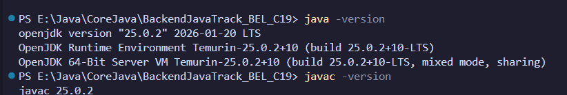

# Java Environment Setup

## JDK version used
- OpenJDK 25.0.2 (LTS)
- Verified via `java -version` and `javac -version` (see screenshot below)



## Hello World program run
1. Create file `HelloWorld.java`:
```java
public class HelloWorld {
    public static void main(String[] args) {
        System.out.println("Hello, World!");
    }
}
```

### Brief explanation of `HelloWorld.java`
- `public class HelloWorld`: defines a public class named `HelloWorld`.
- `public static void main(String[] args)`: JVM entry point where execution begins.
- `System.out.println("Hello, World!");`: prints text to the console.

2. Compile:
```bash
javac HelloWorld.java
```
3. Run:
```bash
java HelloWorld
```
4. Output:
```
Hello, World!
```


