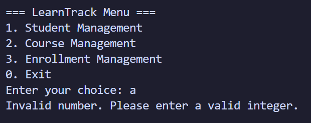
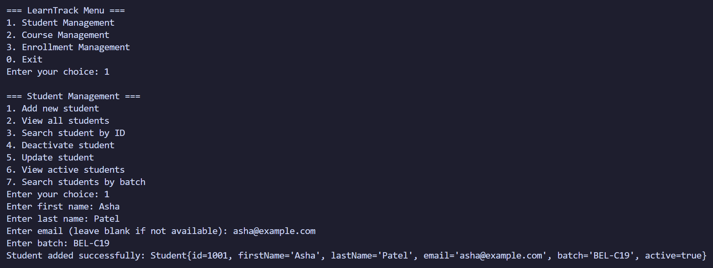
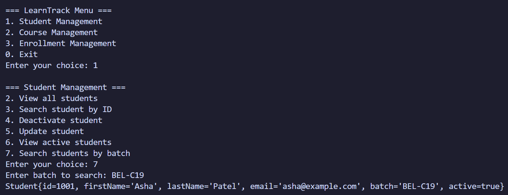
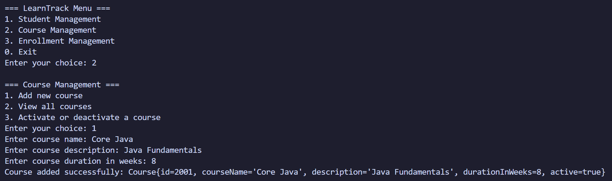
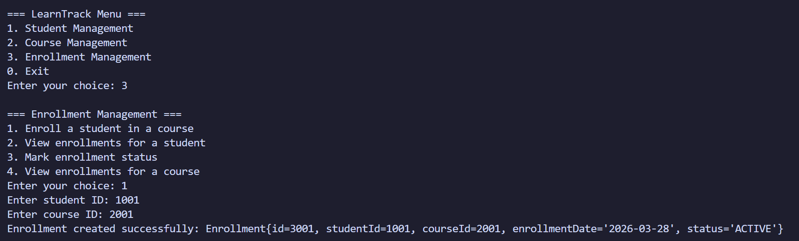
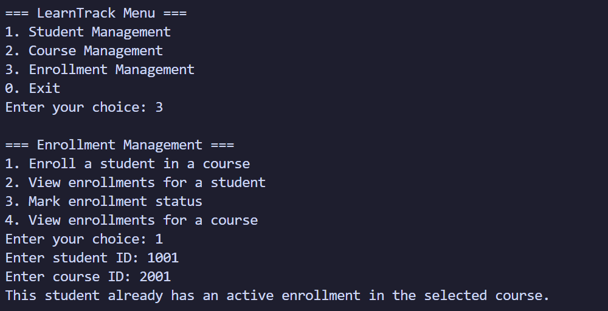
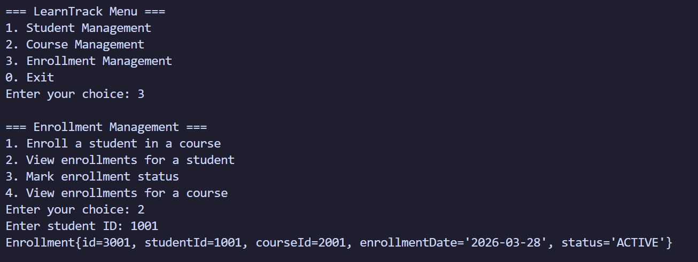
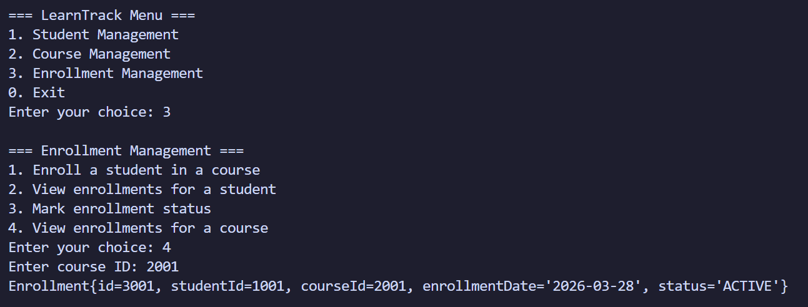
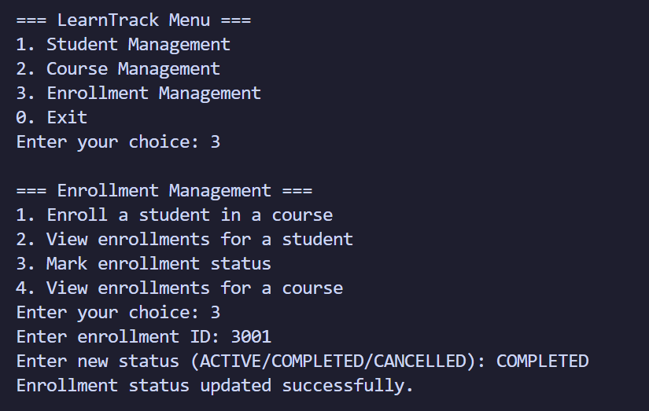
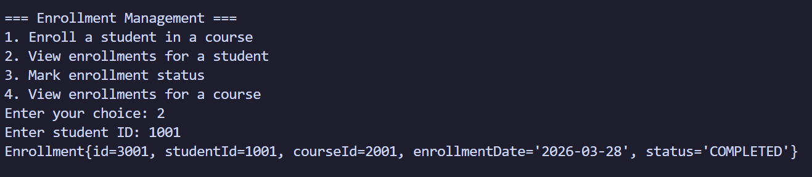

# Testing Notes

## Test Environment
- Java console application run locally
- Compiled output directory: `out`
- Executed using:
  `java -cp out com.airtribe.learntrack.ui.Main`

## Manual Test Cases

### 1. Invalid Main Menu Input
- Input: `a`
- Expected Result: Show invalid number message and return to the main menu
- Actual Result: Passed

### 2. Add Student
- Input:
  - Student Management -> Add new student
  - First name: `Asha`
  - Last name: `Patel`
  - Email: `asha@example.com`
  - Batch: `BEL-C19`
- Expected Result: Student added successfully with generated ID
- Actual Result: Passed

### 3. Search Students by Batch
- Input:
  - Student Management -> Search students by batch
  - Batch: `BEL-C19`
- Expected Result: Display matching student records
- Actual Result: Passed

### 4. Add Course
- Input:
  - Course Management -> Add new course
  - Course name: `Core Java`
  - Description: `Java Fundamentals`
  - Duration in weeks: `8`
- Expected Result: Course added successfully with generated ID
- Actual Result: Passed

### 5. Enroll Student in Course
- Input:
  - Enrollment Management -> Enroll a student in a course
  - Student ID: `1001`
  - Course ID: `2001`
- Expected Result: Enrollment created successfully with status `ACTIVE`
- Actual Result: Passed

### 6. Prevent Duplicate Active Enrollment
- Input:
  - Enrollment Management -> Enroll a student in a course
  - Student ID: `1001`
  - Course ID: `2001`
- Expected Result: Duplicate active enrollment should be blocked
- Actual Result: Passed

### 7. View Enrollments for a Student
- Input:
  - Enrollment Management -> View enrollments for a student
  - Student ID: `1001`
- Expected Result: Show enrollment details for the selected student
- Actual Result: Passed

### 8. View Enrollments for a Course
- Input:
  - Enrollment Management -> View enrollments for a course
  - Course ID: `2001`
- Expected Result: Show enrollment details for the selected course
- Actual Result: Passed

### 9. Update Enrollment Status
- Input:
  - Enrollment Management -> Mark enrollment status
  - Enrollment ID: `3001`
  - Status: `COMPLETED`
- Expected Result: Enrollment status updated successfully
- Actual Result: Passed

### 10. Verify Updated Enrollment Status
- Input:
  - Enrollment Management -> View enrollments for a student
  - Student ID: `1001`
- Expected Result: Enrollment status should display as `COMPLETED`
- Actual Result: Passed

## Notes
- The application handled invalid numeric input without crashing
- Duplicate active enrollments were prevented correctly
- Enrollment status update using enum values worked as expected
- Screenshot evidence can be attached for each test case if needed
