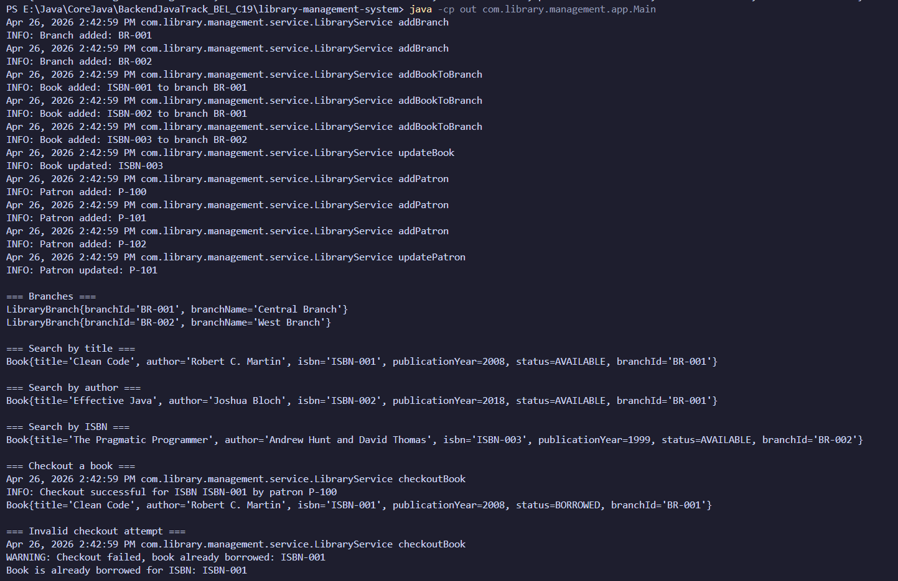
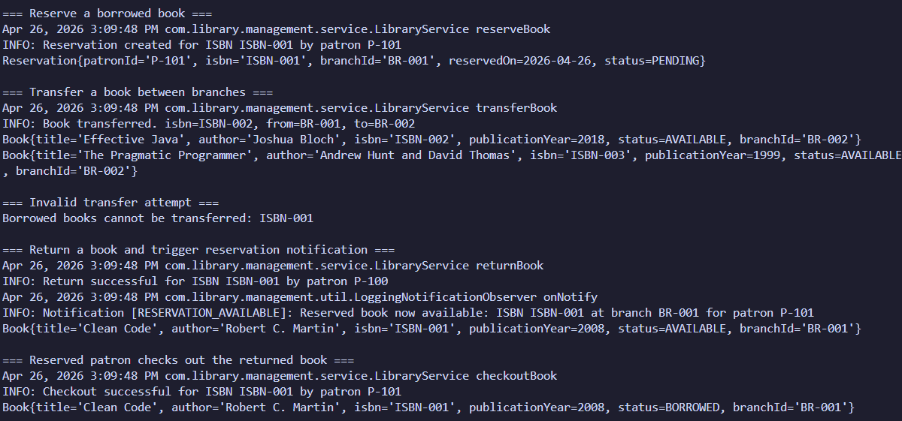
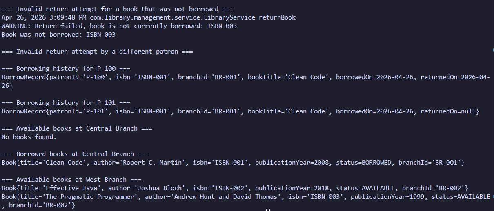

# Testing Notes

## Testing Approach
The project is currently verified through manual execution of the `Main` class.
This is a scripted demo application, so the scenarios below are demonstrated through pre-written flows in `Main.java` rather than through interactive user input.

## Demo Scenarios Covered
1. Add library branches
2. Add books to branches
3. Update a book
4. Search books by title, author, and ISBN
5. Add patrons
6. Update a patron
7. Checkout a book from a branch
8. Invalid checkout attempt for an already borrowed book
9. Reserve a borrowed book
10. Transfer a book between branches
11. Invalid transfer attempt for a borrowed book
12. Return a reserved book and trigger reservation notification
13. Reserved patron checks out the returned book
14. Invalid return attempt for a book that was not borrowed
15. Invalid return attempt by a different patron
16. View borrowing history
17. View branch inventory

## Console Evidence
The following screenshots provide evidence of the console output produced by running `Main.java`.
They show the main scenarios that were executed in the demo flow.

### Screenshot Group 1
- branch creation
- book creation
- patron creation
- search results
- checkout
- invalid checkout

### Screenshot Group 2
- reservation creation
- successful transfer
- invalid transfer
- return with notification
- reserved patron checkout
- invalid return for a book that was not borrowed
- invalid return by a different patron

### Screenshot Group 3
- borrowing history
- branch inventory output

