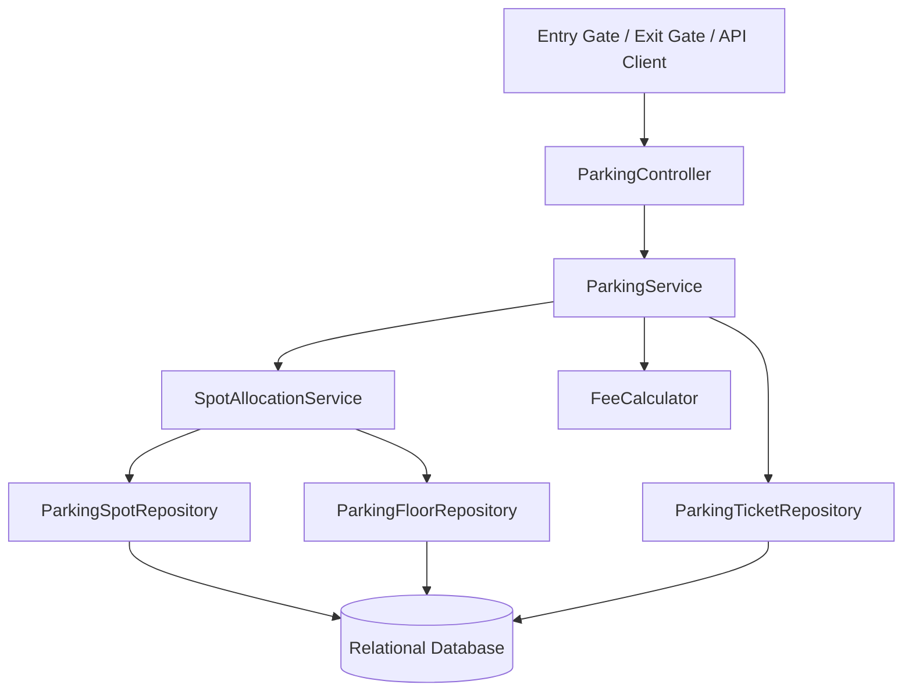
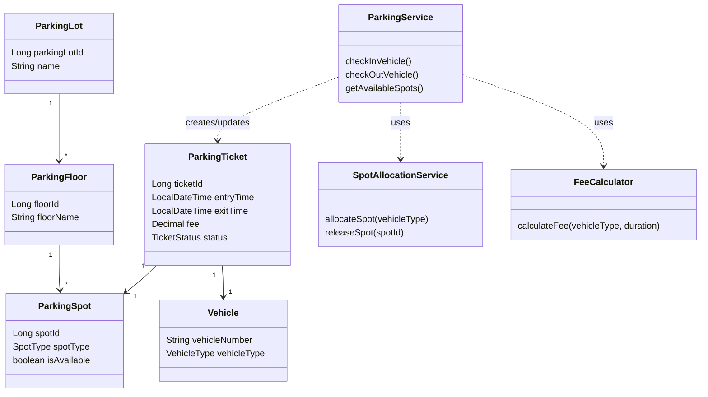
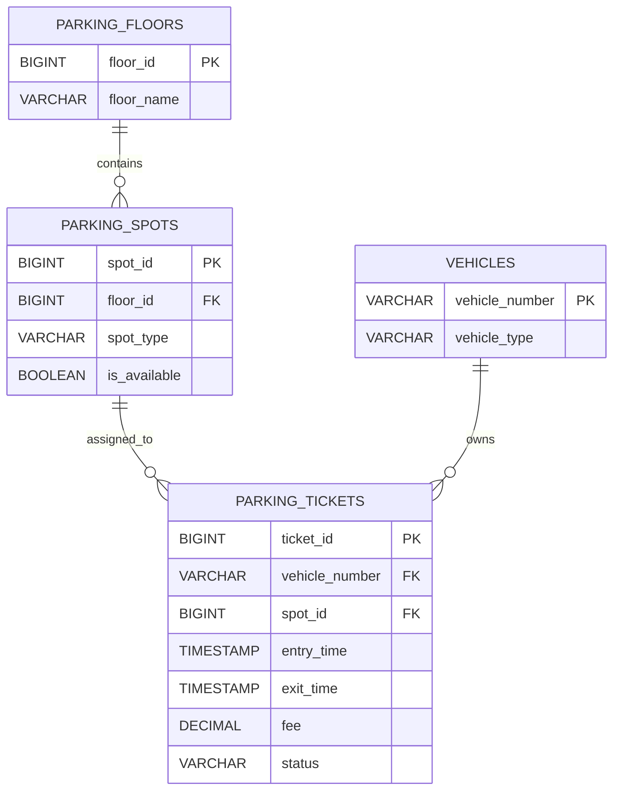
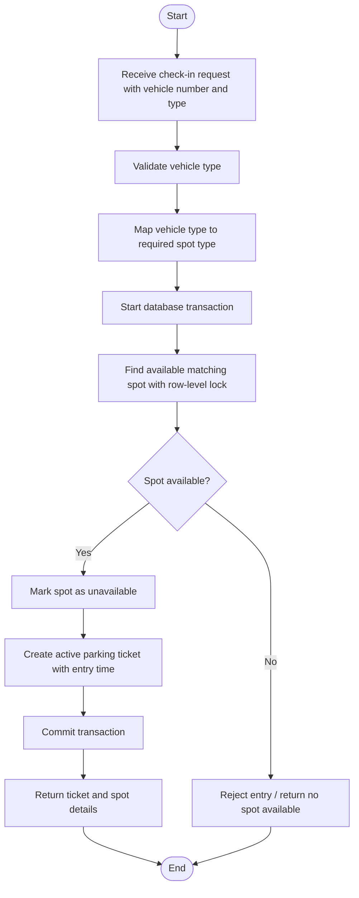
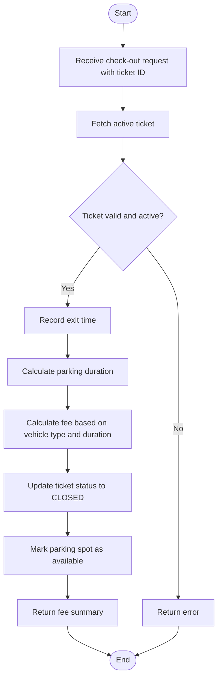

# Smart Parking Lot Backend System  
## Low-Level Design (LLD) Document

This document describes the low-level design for a backend system of a smart parking lot.  
The system handles vehicle entry and exit, parking spot allocation, parking ticket management, real-time availability updates, and parking fee calculation.

---

## 1. Objective

Design the low-level architecture for a backend system of a smart parking lot.

The system should:

- Automatically assign available parking spots based on vehicle size/type.
- Record vehicle check-in and check-out times.
- Track parking spot availability in real time.
- Calculate parking fees when a vehicle exits.
- Handle concurrent vehicle entries and exits safely.

---

## 2. Problem Statement

Imagine a parking lot in an urban area with multiple floors and many parking spots.  
The system should efficiently manage the parking process by assigning available spots to vehicles, tracking the time each vehicle spends in the parking lot, and calculating fees upon exit.

---

## 3. Scope and Assumptions

### In Scope

- Backend low-level design
- Vehicle entry/check-in
- Vehicle exit/check-out
- Parking spot allocation
- Parking ticket generation
- Fee calculation
- Availability tracking
- Concurrency handling

### Out of Scope

- Frontend UI
- Payment gateway integration
- Hardware/sensor integration
- Authentication/authorization
- Admin dashboard
- Dynamic pricing

### Assumptions

- The parking lot has multiple floors.
- Each floor has multiple parking spots.
- Vehicles are categorized as:
  - Motorcycle
  - Car
  - Bus
- Each parking spot supports one specific vehicle category.
- A vehicle can have only one active parking ticket at a time.
- The system uses a relational database.
- Fee is calculated based on vehicle type and parking duration.

---

## 4. Functional Requirements

| Requirement | Description |
|---|---|
| Parking Spot Allocation | Assign an available parking spot based on vehicle type |
| Check-In | Record vehicle entry time and create a parking ticket |
| Check-Out | Record exit time, calculate fee, and close ticket |
| Fee Calculation | Calculate fee based on duration and vehicle type |
| Availability Update | Update spot availability when vehicles enter or leave |
| Concurrency Handling | Prevent two vehicles from getting the same spot |

---

## 5. Layered Backend Architecture



### Layer Responsibilities

| Layer | Responsibility |
|---|---|
| Controller Layer | Exposes REST APIs and receives requests |
| Service Layer | Contains business logic for check-in, check-out, and availability |
| Allocation Service | Finds and reserves parking spots |
| Fee Calculator | Calculates parking charges |
| Repository Layer | Communicates with the database |
| Database Layer | Stores floors, spots, vehicles, and tickets |

---

## 6. Main Classes and Responsibilities



### Class Responsibility Summary

| Class | Responsibility |
|---|---|
| Vehicle | Stores vehicle number and vehicle type |
| ParkingLot | Represents the complete parking lot |
| ParkingFloor | Represents one floor in the parking lot |
| ParkingSpot | Represents one parking spot |
| ParkingTicket | Tracks one parking transaction |
| ParkingService | Coordinates check-in, check-out, and availability |
| SpotAllocationService | Finds and reserves available spots |
| FeeCalculator | Calculates parking fee |

---

## 7. Enums

### VehicleType

```java
enum VehicleType {
    MOTORCYCLE,
    CAR,
    BUS
}
```

### SpotType

```java
enum SpotType {
    MOTORCYCLE_SPOT,
    CAR_SPOT,
    BUS_SPOT
}
```

### TicketStatus

```java
enum TicketStatus {
    ACTIVE,
    CLOSED
}
```

---

## 8. Database Design



### Tables

#### parking_floors

| Column | Type | Description |
|---|---|---|
| floor_id | BIGINT, PK | Unique floor ID |
| floor_name | VARCHAR | Floor name, e.g. Ground Floor |

#### parking_spots

| Column | Type | Description |
|---|---|---|
| spot_id | BIGINT, PK | Unique spot ID |
| floor_id | BIGINT, FK | Floor where the spot exists |
| spot_type | VARCHAR | MOTORCYCLE_SPOT, CAR_SPOT, BUS_SPOT |
| is_available | BOOLEAN | Whether the spot is currently available |

#### vehicles

| Column | Type | Description |
|---|---|---|
| vehicle_number | VARCHAR, PK | Vehicle registration number |
| vehicle_type | VARCHAR | MOTORCYCLE, CAR, BUS |

#### parking_tickets

| Column | Type | Description |
|---|---|---|
| ticket_id | BIGINT, PK | Unique ticket ID |
| vehicle_number | VARCHAR, FK | Vehicle associated with ticket |
| spot_id | BIGINT, FK | Assigned parking spot |
| entry_time | TIMESTAMP | Vehicle entry time |
| exit_time | TIMESTAMP | Vehicle exit time |
| fee | DECIMAL | Final parking fee |
| status | VARCHAR | ACTIVE or CLOSED |

---

## 9. API Design

### 9.1 Check In Vehicle

```http
POST /parking/check-in
```

#### Request Body

```json
{
  "vehicleNumber": "ABC123",
  "vehicleType": "CAR"
}
```

#### Response Body

```json
{
  "ticketId": 1,
  "vehicleNumber": "ABC123",
  "vehicleType": "CAR",
  "spotId": 25,
  "entryTime": "2026-06-27T10:30:00",
  "status": "ACTIVE"
}
```

---

### 9.2 Check Out Vehicle

```http
POST /parking/check-out/{ticketId}
```

#### Response Body

```json
{
  "ticketId": 1,
  "vehicleNumber": "ABC123",
  "entryTime": "2026-06-27T10:30:00",
  "exitTime": "2026-06-27T13:00:00",
  "fee": 15.0,
  "status": "CLOSED"
}
```

---

### 9.3 Get Available Spots

```http
GET /parking/spots/available
```

#### Response Body

```json
{
  "motorcycleSpots": 10,
  "carSpots": 35,
  "busSpots": 5
}
```

---

### 9.4 Get Ticket Details

```http
GET /parking/tickets/{ticketId}
```

This endpoint can be used to fetch the details of a specific parking ticket.

---

## 10. Vehicle Check-In Flow



---

## 11. Vehicle Check-Out Flow



---

## 12. Spot Allocation Algorithm

### Goal

Assign a suitable available parking spot to an incoming vehicle.

### Simple Allocation Strategy

1. Identify the vehicle type.
2. Convert vehicle type to required spot type.
3. Search for available spots of that type.
4. Prefer the lowest floor first.
5. Pick the first available spot.
6. Lock the selected spot.
7. Mark the spot as unavailable.
8. Create the parking ticket.

### Pseudocode

```text
function allocateSpot(vehicleType):
    requiredSpotType = mapVehicleTypeToSpotType(vehicleType)

    spot = findFirstAvailableSpot(requiredSpotType)
           ordered by floorId, spotId
           with database lock

    if spot does not exist:
        throw NoSpotAvailableException

    spot.isAvailable = false
    save(spot)

    return spot
```

---

## 13. Fee Calculation Logic

### Example Fee Rules

| Vehicle Type | Hourly Rate |
|---|---|
| Motorcycle | $2/hour |
| Car | $5/hour |
| Bus | $10/hour |

### Formula

```text
durationHours = max(1, ceil(exitTime - entryTime))
fee = durationHours * hourlyRate(vehicleType)
```

### Pseudocode

```text
function calculateFee(vehicleType, entryTime, exitTime):
    duration = exitTime - entryTime
    durationHours = ceil(duration in hours)

    if durationHours < 1:
        durationHours = 1

    rate = getHourlyRate(vehicleType)

    return durationHours * rate
```

---

## 14. Concurrency Handling

Concurrency is important because multiple vehicles may enter the parking lot at the same time.

### Problem

Two vehicles may try to reserve the same available spot at the same time.

### Solution

Use database transactions and row-level locking.

### Check-In Transaction

The following operations should happen atomically:

1. Find available spot.
2. Lock the selected spot.
3. Mark spot as unavailable.
4. Create parking ticket.
5. Commit transaction.

### Example Repository Logic

```java
@Lock(LockModeType.PESSIMISTIC_WRITE)
@Query("SELECT p FROM ParkingSpot p WHERE p.spotType = :spotType AND p.isAvailable = true ORDER BY p.floorId, p.spotId")
List<ParkingSpot> findAvailableSpotsForUpdate(@Param("spotType") SpotType spotType);
```

### Why This Helps

This prevents two check-in requests from selecting and assigning the same spot.

---

## 15. Service-Level Pseudocode

### Check-In

```java
@Transactional
public ParkingTicket checkInVehicle(Vehicle vehicle) {
    SpotType requiredSpotType = mapVehicleTypeToSpotType(vehicle.getVehicleType());

    ParkingSpot spot = spotAllocationService.allocateSpot(requiredSpotType);

    ParkingTicket ticket = new ParkingTicket();
    ticket.setVehicleNumber(vehicle.getVehicleNumber());
    ticket.setVehicleType(vehicle.getVehicleType());
    ticket.setSpotId(spot.getSpotId());
    ticket.setEntryTime(LocalDateTime.now());
    ticket.setStatus(TicketStatus.ACTIVE);

    return parkingTicketRepository.save(ticket);
}
```

### Check-Out

```java
@Transactional
public ParkingTicket checkOutVehicle(Long ticketId) {
    ParkingTicket ticket = parkingTicketRepository.findById(ticketId)
        .orElseThrow(() -> new RuntimeException("Ticket not found"));

    if (ticket.getStatus() == TicketStatus.CLOSED) {
        throw new RuntimeException("Ticket already closed");
    }

    LocalDateTime exitTime = LocalDateTime.now();

    double fee = feeCalculator.calculateFee(
        ticket.getVehicleType(),
        ticket.getEntryTime(),
        exitTime
    );

    ticket.setExitTime(exitTime);
    ticket.setFee(fee);
    ticket.setStatus(TicketStatus.CLOSED);

    ParkingSpot spot = parkingSpotRepository.findById(ticket.getSpotId())
        .orElseThrow(() -> new RuntimeException("Spot not found"));

    spot.setAvailable(true);
    parkingSpotRepository.save(spot);

    return parkingTicketRepository.save(ticket);
}
```

---

## 16. Error Scenarios

| Scenario | Expected Behaviour |
|---|---|
| No matching spot available | Return no spot available error |
| Invalid vehicle type | Return validation error |
| Invalid ticket ID | Return ticket not found error |
| Ticket already closed | Return ticket already closed error |
| Database conflict | Retry or return concurrency error |
| Duplicate active ticket for same vehicle | Reject check-in or ask user to check out first |

---

## 17. Non-Functional Considerations

### Scalability

- Availability count can be cached if read traffic is high.
- Parking floors and spots can be indexed by `spot_type` and `is_available`.

### Reliability

- Check-in and check-out should be transactional.
- Ticket history should not be deleted.

### Maintainability

- Keep allocation logic separate from fee calculation logic.
- Use enums for vehicle type, spot type, and ticket status.
- Keep REST APIs simple and predictable.

### Extensibility

The design can later support:

- EV charging spots
- VIP parking
- Disabled parking
- Dynamic pricing
- Online reservation
- Payment gateway integration
- Sensor-based spot updates

---

## 18. Suggested Folder Structure

If this is implemented as a backend project, the folder structure can look like this:

```text
src/main/java/com/example/parkinglot
│
├── controller
│   └── ParkingController.java
│
├── service
│   ├── ParkingService.java
│   ├── SpotAllocationService.java
│   └── FeeCalculator.java
│
├── repository
│   ├── ParkingSpotRepository.java
│   ├── ParkingTicketRepository.java
│   └── ParkingFloorRepository.java
│
├── model
│   ├── Vehicle.java
│   ├── ParkingSpot.java
│   ├── ParkingFloor.java
│   └── ParkingTicket.java
│
├── enums
│   ├── VehicleType.java
│   ├── SpotType.java
│   └── TicketStatus.java
│
└── ParkingLotApplication.java
```

---

## 19. Deliverable Summary

This LLD document includes:

- Problem understanding
- Functional requirements
- Assumptions
- Layered architecture
- UML-style class diagram
- ER/database diagram
- API design
- Check-in flowchart
- Check-out flowchart
- Spot allocation algorithm
- Fee calculation logic
- Concurrency handling
- Error scenarios
- Suggested backend folder structure

This is a design-first deliverable. If implementation is required later, this document can be used as the blueprint for coding the backend system.
