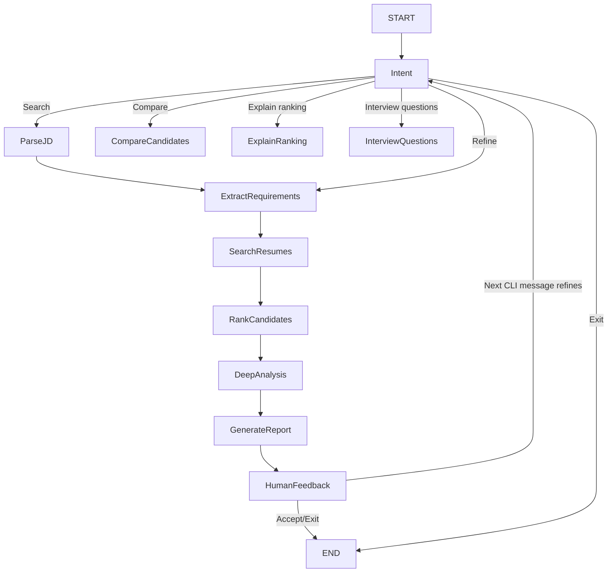

# Milestone 3 Agent Architecture

The implementation lives in `matching_agent.py`. It keeps conversation state
between CLI turns and reuses `job_matcher.match_job_description()` for retrieval,
candidate aggregation, deterministic scoring, eligibility evidence, and ranking
reasoning. The agent adds intent routing, requirement refinement, deep analysis,
reports, comparisons, ranking-change summaries, and interview questions.

The agent explicitly exposes the Milestone 1 filesystem tools through
`available_agent_tools()` and `call_filesystem_tool()`:

- `list_files`
- `read_file`
- `write_file`
- `search_in_file`

The optional Streamlit UI in `app.py` uses the same backend and shows these
tools in the sidebar.

Ranking remains deterministic and explainable. The LLM is used mainly for
natural-language interpretation and synthesis and is not trusted to invent
candidate scores.
