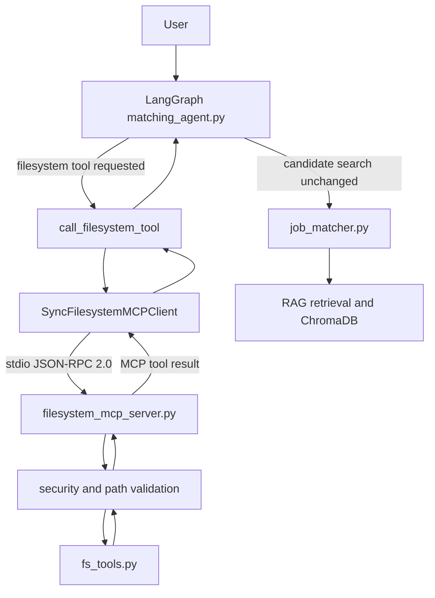

# Milestone 4 MCP Architecture

Milestone 4 moves the agent's custom filesystem access behind a Model Context
Protocol boundary while preserving the existing LangGraph matching workflow.

The separation is intentional:

- Reasoning and workflow: `matching_agent.py`
- Protocol client: `filesystem_mcp_client.py`
- Capability server: `filesystem_mcp_server.py`
- Existing filesystem business logic: `fs_tools.py`
- Candidate search path: `matching_agent.py -> job_matcher.py -> RAG / ChromaDB`

The candidate matching path is not routed through MCP in this milestone.

## MCP Tools

MCP tools are executable capabilities exposed by `filesystem_mcp_server.py`.

- `read_file(filepath)`: reads a supported file under `FILESYSTEM_MCP_ROOT`.
- `list_files(directory=".", extension=None)`: lists files under the configured root.
- `write_file(filepath, content)`: writes text only when `FILESYSTEM_MCP_ALLOW_WRITE=true`.
- `search_in_file(filepath, keyword, context_chars=60)`: searches a supported file.
- `watch_directory(directory=".", duration_seconds=5.0, interval_seconds=0.5, extension=None, recursive=False)`: performs bounded polling and returns created, modified, and deleted files.
- `batch_process(operation, directory=None, filepaths=None, extension=None, keyword=None, max_files=None, continue_on_error=True)`: runs `read`, `search`, or `metadata/list` over several files and returns per-file results.

`watch_directory` never starts an unbounded background process. Its duration is
capped by `FILESYSTEM_MCP_WATCH_MAX_SECONDS`.

`batch_process` makes partial success explicit. If one item fails and
`continue_on_error=True`, later files are still processed and the response
contains `partial_success=True`.

## MCP Resources

MCP resources are readable context entries, not executable tools.

- `filesystem://root`: current root, write setting, limits, and transport.
- `filesystem://files`: listing of files at the configured root.

Clients discover resources with MCP `resources/list` and read them with
`resources/read`.

## Security

All MCP tool paths go through a centralized resolver before reaching `fs_tools.py`.
The resolver:

- resolves relative paths against `FILESYSTEM_MCP_ROOT`
- normalizes Windows and POSIX paths
- rejects `..` traversal
- rejects absolute paths outside the configured root
- resolves existing paths to reduce symlink escape risk
- rejects invalid file or directory inputs
- enforces `FILESYSTEM_MCP_MAX_FILE_BYTES` before read/search/metadata operations
- keeps writes disabled by default

The server returns stable structured error codes such as:

- `path_outside_root`
- `not_found`
- `not_file`
- `not_directory`
- `unsupported_extension`
- `write_disabled`
- `invalid_arguments`

## Transport

The implementation uses the official MCP Python SDK over stdio. The client
launches `filesystem_mcp_server.py` with `sys.executable`, passes the parent
environment, and communicates through MCP JSON-RPC messages over stdio.

Operational diagnostics should go to stderr so stdout remains reserved for MCP
protocol traffic.

## Assignment Requirement Audit

Part A:

- `filesystem_mcp_server.py`: implemented.
- Milestone 1 tools exposed via MCP: `read_file`, `list_files`, `write_file`, `search_in_file`.
- `watch_directory`: implemented as bounded polling.
- `batch_process`: implemented for read, search, and metadata/list operations.
- JSON-RPC 2.0 / MCP SDK transport: implemented through official MCP stdio APIs.
- Error handling: structured responses with stable codes.
- Resource discovery: `filesystem://root` and `filesystem://files`.
- Configuration management: `.env.example` documents root, writes, limits, and transport.

Part B:

- `matching_agent.py` refactored: filesystem dispatch now uses `SyncFilesystemMCPClient`.
- No direct filesystem dispatch: `matching_agent.py` no longer imports or calls `fs_tools`.
- MCP client integration: implemented in `filesystem_mcp_client.py`.
- Existing LangGraph behavior preserved: search, refinement, comparison, ranking explanation, interview questions, and exit tests pass.

Deliverables:

- MCP server implementation: complete.
- Refactored agent filesystem boundary: complete.
- Discovery: tools and resources covered by tests.
- Watch/batch tools: complete.
- Workflow diagram: this document.
- Tests: server, client, agent, and integration suites.
- Demo instructions: see `README.md`.

No multi-MCP bonus, LangSmith integration, or RAG/job matcher refactor is included.
