# PayFlow API

## 1. Project overview

PayFlow is a simplified UPI-style wallet backend API built with Spring Boot. It supports registering users, finding users, listing users by balance, and saving simple money transfer transactions.

This is a beginner-to-mid level Spring Boot project. It intentionally keeps the design simple: transactions store sender and receiver UPI IDs as plain strings, and no balance deduction or authentication is added.

## 2. How to run the application

From the `payflow-api` folder, run:

```bash
mvn spring-boot:run
```

H2 console:

```text
http://localhost:8080/h2-console
```

Use this JDBC URL in the H2 console:

```text
jdbc:h2:mem:payflowdb
```

Username:

```text
sa
```

Password is empty.

## 3. Layer explanation

Entity layer: Contains Java classes that map to database tables. In this project, `User` maps to the `users` table and `Transaction` maps to the `transactions` table.

Repository layer: Contains interfaces that extend `JpaRepository`. Spring Data JPA creates the implementation automatically, so we can call methods like `save`, `findAll`, and `findById`.

Service layer: Contains business methods used by the controllers. In this project, the services keep the code simple and call the repositories directly.

Controller layer: Contains REST API endpoints. The controllers receive HTTP requests, call the service layer, and return Java objects that Spring converts to JSON.

## 4. Spring Boot features

Embedded server: The application runs on embedded Tomcat, so we do not need to install or configure a separate external server.

Auto-configuration: Spring Boot looks at the dependencies in `pom.xml` and automatically configures Spring Web, Spring Data JPA, H2 database support, and repository beans.

Production-ready defaults: Spring Boot provides sensible defaults for startup, logging, configuration, and application behavior. More production features, such as Actuator endpoints, can be added later if needed.

## 5. API endpoints

Task 5 endpoints:

| Method | Endpoint | Description |
| --- | --- | --- |
| POST | `/users` | Register a user |
| GET | `/users` | Get all registered users |
| GET | `/users/{id}` | Get one user by `userId` |
| POST | `/transactions` | Save a money transfer transaction |

Task 6 endpoints:

| Method | Endpoint | Description |
| --- | --- | --- |
| GET | `/users/upi/{upiId}` | Find a user by UPI ID |
| GET | `/users/balance/above/{amount}` | Find users whose balance is greater than the amount |

## 6. curl commands and sample outputs

### Create Priya

```bash
curl -X POST http://localhost:8080/users \
-H "Content-Type: application/json" \
-d '{"name":"Priya Sharma","upiId":"priya@okaxis","balance":5000.0,"phoneNumber":"9876543210"}'
```

Sample output:

```json
{
  "userId": 1,
  "name": "Priya Sharma",
  "upiId": "priya@okaxis",
  "balance": 5000.0,
  "phoneNumber": "9876543210"
}
```

Screenshot:

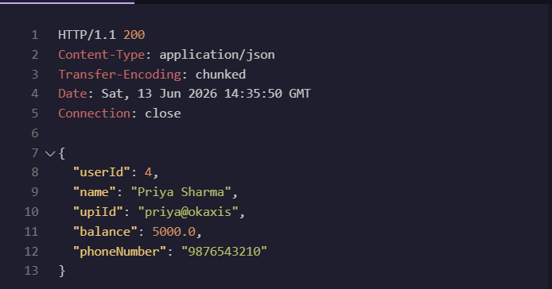

### Create Rahul

```bash
curl -X POST http://localhost:8080/users \
-H "Content-Type: application/json" \
-d '{"name":"Rahul Verma","upiId":"rahul@ybl","balance":3000.0,"phoneNumber":"9123456780"}'
```

Sample output:

```json
{
  "userId": 2,
  "name": "Rahul Verma",
  "upiId": "rahul@ybl",
  "balance": 3000.0,
  "phoneNumber": "9123456780"
}
```

Screenshot:

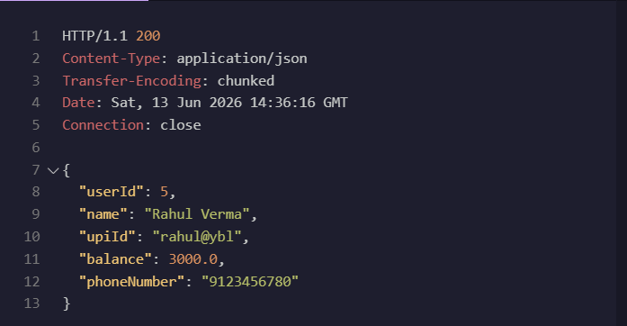

### Get all users

```bash
curl http://localhost:8080/users
```

Sample output:

```json
[
  {
    "userId": 1,
    "name": "Priya Sharma",
    "upiId": "priya@okaxis",
    "balance": 5000.0,
    "phoneNumber": "9876543210"
  },
  {
    "userId": 2,
    "name": "Rahul Verma",
    "upiId": "rahul@ybl",
    "balance": 3000.0,
    "phoneNumber": "9123456780"
  }
]
```

Screenshot:

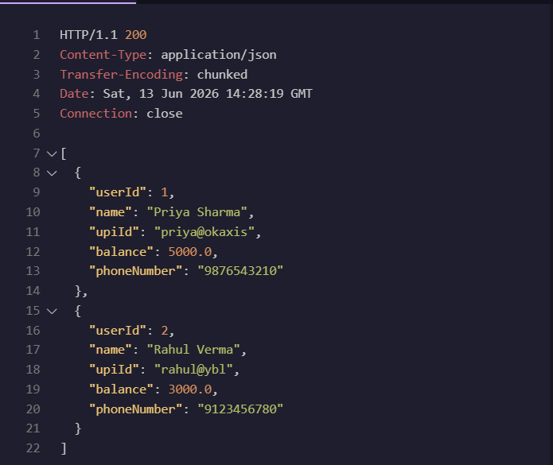

### Get user by ID

```bash
curl http://localhost:8080/users/1
```

Sample output:

```json
{
  "userId": 1,
  "name": "Priya Sharma",
  "upiId": "priya@okaxis",
  "balance": 5000.0,
  "phoneNumber": "9876543210"
}
```

Screenshot:

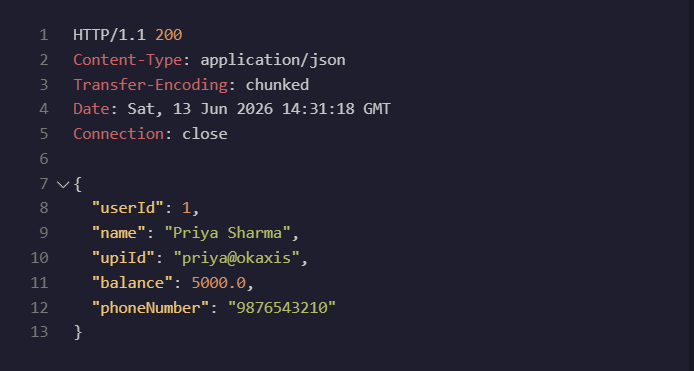

### Get user by UPI ID

```bash
curl http://localhost:8080/users/upi/rahul@ybl
```

Sample output:

```json
{
  "userId": 2,
  "name": "Rahul Verma",
  "upiId": "rahul@ybl",
  "balance": 3000.0,
  "phoneNumber": "9123456780"
}
```

Screenshot:

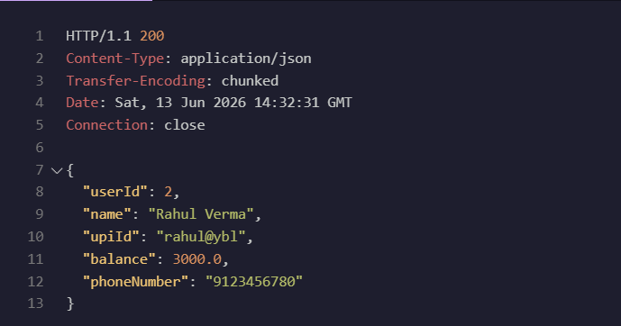

### Get users above balance

```bash
curl http://localhost:8080/users/balance/above/4000
```

Sample output:

```json
[
  {
    "userId": 1,
    "name": "Priya Sharma",
    "upiId": "priya@okaxis",
    "balance": 5000.0,
    "phoneNumber": "9876543210"
  }
]
```

### Create transaction

```bash
curl -X POST http://localhost:8080/transactions \
-H "Content-Type: application/json" \
-d '{"senderUpiId":"priya@okaxis","receiverUpiId":"rahul@ybl","amount":500.0,"note":"dinner split"}'
```

Sample output:

```json
{
  "transactionId": 1,
  "senderUpiId": "priya@okaxis",
  "receiverUpiId": "rahul@ybl",
  "amount": 500.0,
  "note": "dinner split"
}
```

Screenshot:

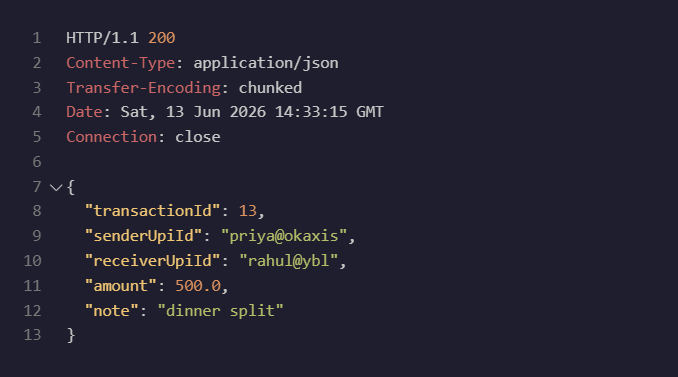

## 7. H2 console queries

```sql
SELECT * FROM USERS;
```

Before inserting data:

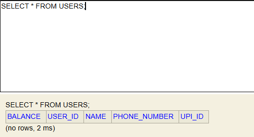

```sql
SELECT * FROM TRANSACTIONS;
```

Before inserting data:

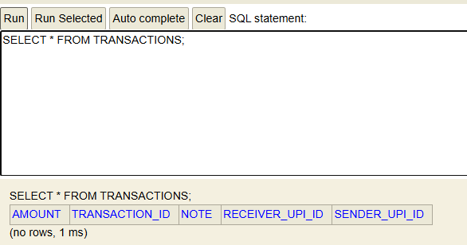

After inserting two users and one transaction:

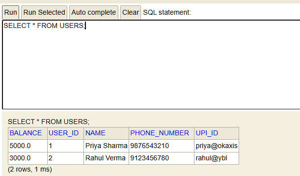

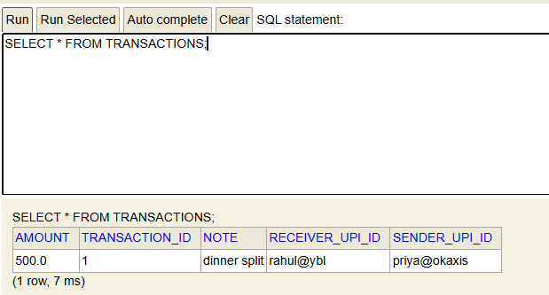

To view the generated table columns in H2, use the schema-filtered `INFORMATION_SCHEMA.COLUMNS` queries below.

```sql
SELECT COLUMN_NAME, DATA_TYPE, IS_NULLABLE
FROM INFORMATION_SCHEMA.COLUMNS
WHERE TABLE_SCHEMA = 'PUBLIC'
AND TABLE_NAME = 'USERS'
ORDER BY ORDINAL_POSITION;
```

```sql
SELECT COLUMN_NAME, DATA_TYPE, IS_NULLABLE
FROM INFORMATION_SCHEMA.COLUMNS
WHERE TABLE_SCHEMA = 'PUBLIC'
AND TABLE_NAME = 'TRANSACTIONS'
ORDER BY ORDINAL_POSITION;
```

## 8. Generated table structure evidence

H2 automatically creates the tables from the JPA entity classes when the application starts because `spring.jpa.hibernate.ddl-auto=create` is configured.

Generated SQL for `users`:

```sql
create table users (
    balance float(53),
    user_id bigint generated by default as identity,
    name varchar(255),
    phone_number varchar(255),
    upi_id varchar(255) unique,
    primary key (user_id)
);
```

Generated SQL for `transactions`:

```sql
create table transactions (
    amount float(53),
    transaction_id bigint generated by default as identity,
    note varchar(255),
    receiver_upi_id varchar(255),
    sender_upi_id varchar(255),
    primary key (transaction_id)
);
```

The table structure screenshots are saved in the `submission-screenshots` folder:

```text
01-users-table-structure.png
02-transactions-table-structure.png
```

The `USERS` table contains the generated columns for the `User` entity:

```sql
BALANCE
USER_ID
NAME
PHONE_NUMBER
UPI_ID
```

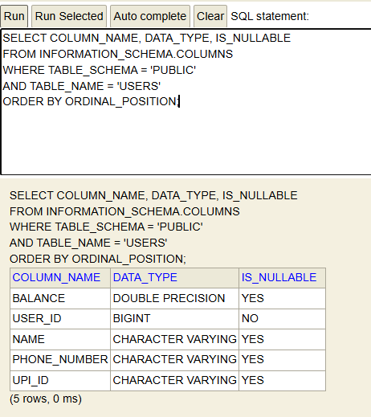

The `TRANSACTIONS` table contains the generated columns for the `Transaction` entity:

```sql
AMOUNT
TRANSACTION_ID
NOTE
RECEIVER_UPI_ID
SENDER_UPI_ID
```

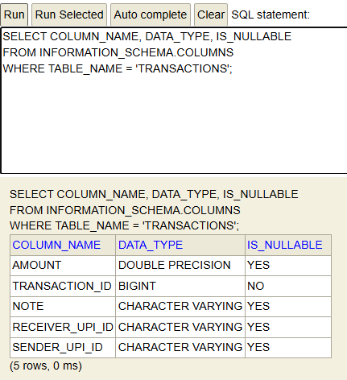

## 9. Explain `findByUpiId`

`findByUpiId` is a derived query method. Spring Data JPA reads the method name and understands that it should create a query using the `upiId` field of the `User` entity.

When Hibernate prints generated SQL, we may see a `?` placeholder. The `?` is a parameter placeholder where the actual UPI ID value is safely bound at runtime.

## findByUpiId query demonstration

Run this curl command to trigger the query:

```bash
curl http://localhost:8080/users/upi/rahul@ybl
```

Screenshot:


Generated SQL:

```sql
select
    u1_0.user_id,
    u1_0.balance,
    u1_0.name,
    u1_0.phone_number,
    u1_0.upi_id
from
    users u1_0
where
    u1_0.upi_id=?
```

Spring Data JPA derives the query from the method name `findByUpiId`. It understands that it should search using the `upiId` field of the `User` entity.

When Hibernate prints the generated SQL in the console, the `?` placeholder is where the actual UPI ID parameter value is safely bound at runtime.

## 10. Explain `@RequestBody`

`@RequestBody` tells Spring and Jackson to convert incoming JSON from the HTTP request body into a Java object such as `User` or `Transaction`.

Without `@RequestBody`, Spring does not deserialize the JSON body into the object, so the object fields may be `null`.

### Demonstration with `@RequestBody`

For this test, the `POST /users` method was temporarily updated to print the incoming `User` object:

```java
@PostMapping
public User registerUser(@RequestBody User user) {
    System.out.println(user);
    return userService.registerUser(user);
}
```

Request body used:

```json
{
  "name": "Request Body Test",
  "upiId": "requestbody@test",
  "balance": 1000.0,
  "phoneNumber": "9000000000"
}
```

Console output:

```text
User{userId=null, name='Request Body Test', upiId='requestbody@test', balance=1000.0, phoneNumber='9000000000'}
Hibernate:
    insert
    into
        users
        (balance, name, phone_number, upi_id, user_id)
    values
        (?, ?, ?, ?, default)
```

Response output:

```json
{
  "userId": 1,
  "name": "Request Body Test",
  "upiId": "requestbody@test",
  "balance": 1000.0,
  "phoneNumber": "9000000000"
}
```

This shows that Spring/Jackson successfully read the JSON request body and created a Java `User` object with the correct field values.

### Demonstration without `@RequestBody`

For comparison, `@RequestBody` was temporarily removed from the same controller method:

```java
@PostMapping
public User registerUser(User user) {
    System.out.println(user);
    return userService.registerUser(user);
}
```

The same type of JSON request was sent, but Spring did not deserialize the JSON request body into the `User` object.

Console output:

```text
User{userId=null, name='null', upiId='null', balance=null, phoneNumber='null'}
Hibernate:
    insert
    into
        users
        (balance, name, phone_number, upi_id, user_id)
    values
        (?, ?, ?, ?, default)
```

Response output:

```json
{
  "userId": 1,
  "name": null,
  "upiId": null,
  "balance": null,
  "phoneNumber": null
}
```

This happens because, without `@RequestBody`, Spring MVC does not ask Jackson to read the JSON body and convert it into a Java `User` object. The request still reaches the controller, but the object fields are not filled from the JSON payload, so they remain `null`. With `@RequestBody`, Jackson deserializes the JSON keys such as `name`, `upiId`, `balance`, and `phoneNumber` into the matching Java fields.

How to demonstrate this:

1. First call `POST /users` with `@RequestBody` in the controller method and print the `User` object.
2. Then temporarily remove `@RequestBody` from the controller method and call the same endpoint again.
3. Without `@RequestBody`, Spring does not deserialize the JSON request body into the Java object, so the object fields are `null`.

## 11. Compare query approaches

Derived method names: These are simple queries generated from method names, such as `findByUpiId`.

`@Query` JPQL: This is a custom object-based query that uses entity class names and Java field names. Example: `select u from User u where u.balance > :amount`.

Native SQL: This is raw database-specific SQL. It is the least preferred option for this project because it is tightly coupled to the database and less portable.

## 12. Conceptual write-up answers

Request lifecycle including `DispatcherServlet` and `HandlerAdapter`: When a request comes to a Spring Boot REST API, it first reaches the embedded Tomcat server. Tomcat forwards it to Spring MVC's `DispatcherServlet`, which acts as the front controller. The `DispatcherServlet` finds the correct controller method using handler mappings and uses a `HandlerAdapter` to call that method. The returned Java object is converted to JSON and sent back as the HTTP response.

Serialisation/deserialisation and what happens with `upi_id` vs `upiId`: Deserialization means converting incoming JSON into a Java object, and serialization means converting a Java object back into JSON. By default, Jackson expects JSON field names to match Java property names such as `upiId`, not database column names such as `upi_id`. Hibernate may create the database column as `upi_id`, but the REST JSON field should still be `upiId` unless we add extra Jackson configuration. So the API request should use `"upiId":"rahul@ybl"`.

Spring Boot features: Spring Boot reduces setup by providing auto-configuration, starter dependencies, and an embedded server. In this project, the web server, JPA setup, H2 database connection, and repository implementations are configured mostly from the dependencies and `application.properties`. This lets us focus on writing entities, repositories, services, and controllers instead of long XML or server configuration.

Spring vs Spring Boot: Spring is the main framework that provides dependency injection, beans, MVC, data access support, and many other modules. Spring Boot is built on top of Spring and makes it faster to create applications with less manual configuration. For this project, Spring provides concepts like controllers, services, repositories, and dependency injection, while Spring Boot starts the app and auto-configures the common setup.

Stateless REST and load balancer example: A stateless REST API does not store client session data inside the server between requests. Each request should contain the information needed for that operation. This makes scaling easier because a load balancer can send request one to server A and request two to server B without depending on server memory. In PayFlow, the saved data is in the database, not in a Java `List` stored only in one controller object.

Persistence: H2 database vs Java `List`: A Java List stores data only inside application memory, so if the server restarts, all transaction records would be lost. That is unacceptable for a payments app because payment history must be stored reliably and auditable after the request finishes. In this assignment, H2 is used as a lightweight database to practise real persistence concepts such as tables, generated IDs, SQL, and repositories. Since this project uses an in-memory H2 database, data may still reset when the app restarts, but the structure is closer to how a real payments system would use a persistent database like MySQL or PostgreSQL.
