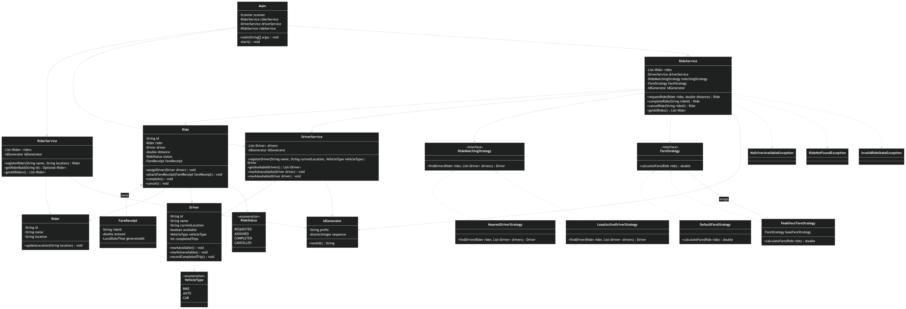

# RideWise Class Diagram

The RideWise class diagram represents the main entities, services, strategies, and utility classes used in the console-based ride-sharing system.

The `Main` class acts as the entry point of the application and interacts only with the service layer. `RiderService`, `DriverService`, and `RideService` separate the core responsibilities of the system. `RiderService` manages rider registration and lookup, `DriverService` manages driver registration and availability, and `RideService` coordinates the ride lifecycle.

The domain model contains `Rider`, `Driver`, `Ride`, and `FareReceipt`. A `Ride` is associated with one `Rider` and one assigned `Driver`. It also owns a `FareReceipt`, which demonstrates composition because the fare receipt exists as part of the ride details. `RideStatus` and `VehicleType` are enums used to keep ride state and vehicle category values consistent.

The strategy interfaces show the extensibility of the design. `RideMatchingStrategy` is implemented by `NearestDriverStrategy` and `LeastActiveDriverStrategy`, allowing the driver allocation logic to change without modifying `RideService`. Similarly, `FareStrategy` is implemented by `DefaultFareStrategy` and `PeakHourFareStrategy`, allowing pricing logic to be extended independently.

The diagram also shows dependency inversion clearly: `RideService` depends on strategy interfaces rather than concrete implementations. This keeps the system loosely coupled, easier to test, and open for future extensions.

