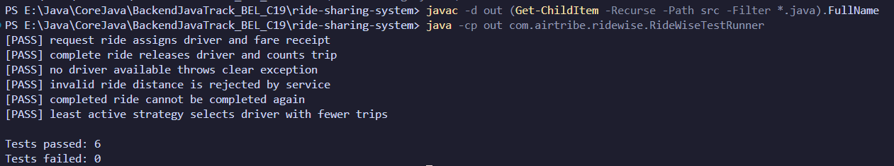
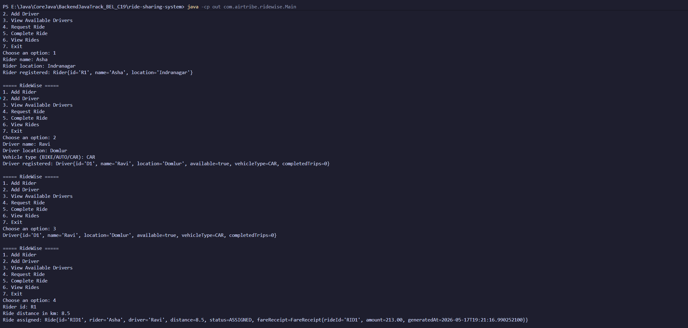
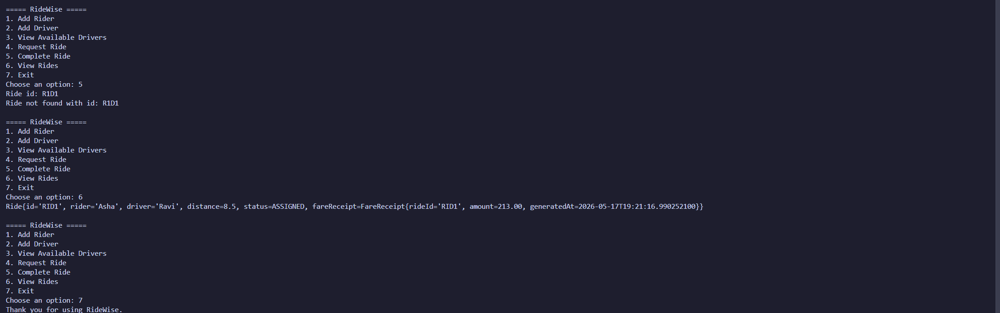

# RideWise Testing Notes

## Test Environment

- Java console application run locally
- Compiled output directory: `out`
- External dependencies: none
- Test runner: `com.airtribe.ridewise.RideWiseTestRunner`


## Automated Test Runner

From `ride-sharing-system`:

```powershell
java -cp out com.airtribe.ridewise.RideWiseTestRunner
```

Expected output summary:

```text
Tests passed: 6
Tests failed: 0
```

Screenshot evidence:



## Automated Test Cases

### 1. Request Ride Assigns Driver and Fare Receipt

- Input: Create one rider, create one driver, request a 5 km ride
- Expected Result: Ride status becomes `ASSIGNED`, driver is attached, and fare receipt is generated
- Actual Result: Passed

### 2. Complete Ride Releases Driver

- Input: Request a ride and complete it using the generated ride ID
- Expected Result: Ride status becomes `COMPLETED`, driver becomes available, completed trip count increases
- Actual Result: Passed

### 3. No Driver Available

- Input: Register a rider but no drivers, then request a ride
- Expected Result: `NoDriverAvailableException` is thrown
- Actual Result: Passed

### 4. Invalid Ride Distance

- Input: Request a ride with distance `0`
- Expected Result: `RideService` rejects the request with `IllegalArgumentException`
- Actual Result: Passed

### 5. Completed Ride Cannot Be Completed Again

- Input: Complete a ride, then try to complete the same ride again
- Expected Result: `InvalidRideStateException` is thrown
- Actual Result: Passed

### 6. Least Active Driver Strategy

- Input: Use `LeastActiveDriverStrategy` after one driver already completed a trip
- Expected Result: The driver with fewer completed trips is selected
- Actual Result: Passed

## Manual Console Flow

From `ride-sharing-system`:

```powershell
java -cp out com.airtribe.ridewise.Main
```

Suggested manual flow:

1. Add Rider
2. Add Driver
3. View Available Drivers
4. Request Ride
5. Complete Ride
6. View Rides
7. Exit

Screenshot evidence:




## Notes

- `out/` is generated during local compilation and ignored by Git.
- The test runner validates strategy interchangeability, fare generation, ride lifecycle, and service-level edge cases.
- Add screenshots to `docs/screenshots/` using the file names referenced above before final submission.
